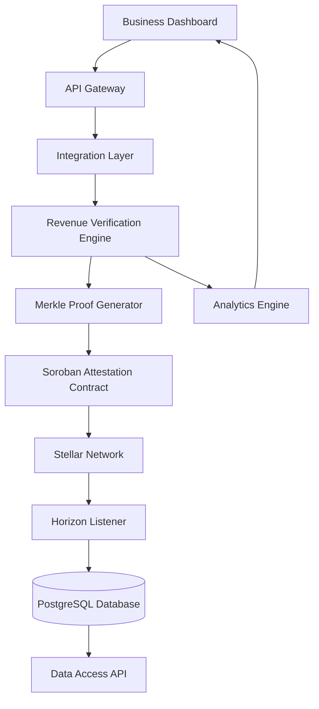

# Veritasor

## Revenue Attestations

---

## 1. Overview

Veritasor is an on-chain revenue attestation protocol built on the Stellar network.  
It enables businesses to cryptographically verify and publish revenue proofs on-chain using Soroban smart contracts.

The protocol provides:

- Revenue verification via trusted API integrations
- Cryptographic proof generation
- On-chain hashed attestations
- Public auditability
- Structured data access for lenders and investors

Veritasor functions as a financial truth layer for Web3 infrastructure.

---

## 2. Problem Statement

Web3 lacks a standardized method to verify real-world business performance.

Current limitations:

- No trusted revenue oracle layer
- Revenue-based lending requires off-chain trust
- Tokenized revenue models lack verifiable proof
- Manual reporting is opaque and unverifiable
- Investors rely on screenshots and PDFs

Price oracles are common.  
Revenue oracles do not exist in a structured, programmable form.

---

## 3. Solution

Veritasor introduces a cryptographically verifiable revenue attestation system.

Process:

1. Business connects financial platforms (Stripe, Razorpay, Shopify, etc.)
2. System fetches revenue data via secure API
3. Revenue data is normalized and hashed
4. A Merkle root is generated
5. Hash and metadata are published on Stellar
6. Full proof can be validated off-chain

The blockchain stores immutable attestations, not raw financial data.

---

## 4. High-Level Architecture



---

## 5. Core Components

### 5.1 API Integration Layer

- OAuth authentication
- Secure API calls
- Data normalization
- Scheduled data pulls
- Supported integrations (initial): Stripe, Razorpay, Shopify, App Store Connect, SaaS billing systems

### 5.2 Revenue Verification Engine

- Normalize revenue data
- Remove refunds and chargebacks
- Generate monthly summaries
- Validate currency conversion (optional)
- Detect anomalies

Revenue structure example:

```json
{
  "business_id": "uuid",
  "period": "2026-02",
  "gross_revenue": 50000,
  "net_revenue": 47000,
  "currency": "USD"
}
```

### 5.3 Merkle Proof Generator

- Protect sensitive data
- Enable selective disclosure
- Maintain cryptographic integrity
- Process: Revenue entries hashed → Merkle tree → Root hash → Root on-chain; full dataset stored encrypted off-chain

### 5.4 Soroban Attestation Contract

- Store revenue root hash, period metadata, business address
- Emit attestation event
- Prevent duplicate attestations
- Core methods: `submit_attestation()`, `verify_attestation()`, `get_attestation()`, `revoke_attestation()` (optional)

---

## 6. Repositories

This monorepo contains three separate repositories:

| Repository            | Description                          |
|-----------------------|--------------------------------------|
| **veritasor-frontend**| Business dashboard and UI            |
| **veritasor-backend** | API gateway, integrations, attestation service (TypeScript/Express) |
| **veritasor-contracts**| Soroban smart contracts on Stellar  |

Each has its own README with local setup instructions. Initialize and push each to its own remote when ready.

---

## 7. Tech Stack

- **Blockchain:** Stellar, Soroban, Stellar SDK
- **Backend:** TypeScript, Express, PostgreSQL, Redis
- **Frontend:** React, TypeScript
- **Cryptography:** SHA-256, Merkle trees, AES-256
- **Infrastructure:** Docker, Kubernetes, AWS/GCP

---

## 8. Privacy Model

- **On-chain:** Merkle root, timestamp, business address only
- **Off-chain:** Encrypted revenue details, Merkle proof tree, verification metadata
- Selective disclosure via proof generation

---

## 9. Target Users

- SaaS startups
- E-commerce businesses
- AI platforms
- Revenue-based lenders
- Tokenization platforms

Veritasor is a programmable revenue truth infrastructure layer, not a financial dashboard.
